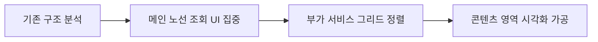
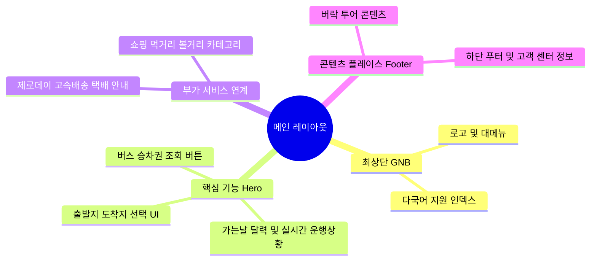

# 🚌 서울고속버스터미널 (Seoul Express Bus Terminal) 웹 웹사이트 리디자인

> 복잡한 정보 구조를 직관적으로 재정렬하고, 사용자의 여정을 즐거움으로 연결하는 UI/UX 및 웹 인터페이스 리디자인 프로젝트입니다.

👉 [실제 배포된 리디자인 웹사이트 보러가기](https://sormadbwls-ux.github.io/redesign-project/)

---

## 📌 1. 프로젝트 개요

| 구분 | 내용 |
|---|---|
| **대상 서비스** | 서울고속버스터미널 공식 웹사이트 |
| **핵심 목표** | 복잡한 버스 조회 화면의 레이아웃 시인성 개선 및 핵심 부가 서비스 시각적 통합 |
| **사용 도구** | Figma, Photoshop, Illustrator, VS Code |
| **디자인 방향** | 고속도로의 Grey(도로), Yellow(중앙선), Sky Blue(버스 여정) 요소를 직관적인 인터페이스 컬러 시스템(Identity)으로 승화하여 컴포넌트 시인성 극대화 |

---

## ⚙️ 2. 리디자인 접근 프로세스

기존 공공 웹사이트 형태의 복잡한 메인 화면을 사용자 행동 순서(여정)에 맞춰 구조화했습니다.

---

## 🧠 3. 정보 구조 및 화면 구성 (IA Map)

유저가 터미널 사이트에 접속하는 본질적인 목적인 '예매'를 최상단에 두고, 쇼핑/먹거리/교통 정보를 하단에 정돈한 레이아웃 구조입니다.

---

## 📂 4. 주요 리디자인 설계 포인트

| 영역 | 세부 설계 내용 및 포인트 | 활용 툴 |
|---|---|---|
| **노선 및 승차권 조회** | 출발/도착지 선택 및 실시간 운행 상황을 한눈에 볼 수 있는 격자형 위젯 UI 컴포넌트 설계 | Figma |
| **제로데이 택배 배너** | 정보 인지도를 높이기 위해 집앞 픽업 등의 핵심 문구를 아이콘 태그와 함께 비주얼 배너로 시각화 | Photoshop, Figma |
| **버-락(bus-樂) 콘텐츠** | 터미널 야경 비주얼 소스를 배경으로 활용하여 '서울의 즐거움'을 전달하는 스토리텔링 레이아웃 구축 | Photoshop, Figma |

---

## 💡 5. Project Reflection (성장 회고)

이 프로젝트는 UI/UX 디자이너로서 웹 인터페이스를 정밀하게 분석하고 코드 환경에서 직접 구현해 본 **소중한 첫 번째 도전**입니다.

* **그리드 기반 레이아웃 학습**: 고속도로 환경의 시각적 요소(Grey, Yellow, Sky Blue)를 활용한 브랜딩 컬러 시스템을 정립하고, 대량의 교통 데이터를 시각적으로 정렬하는 감각을 다질 수 있었습니다.
* **벡터 그래픽 자산 최적화**: 웹 표준에 맞춰 크기 변화에도 깨지지 않는 아이콘과 그래픽 소스들을 일러스트레이터(SVG)로 정교하게 가공해 보는 경험을 쌓았습니다.
* **실제 구현 환경과의 간극 경험**: VS Code를 통해 디자인을 실제 웹 화면(HTML/CSS)으로 옮기는 과정에서 **레이아웃 배치 및 반응형 구현의 기술적 한계와 아쉬움**을 직접 경험했습니다. 
* **차기작의 원동력**: 이 과정에서 화면 구조(마크업)에 대한 이해도가 크게 확장되었으며, 디자인과 구현의 간극을 좁히기 위한 고민은 차기 프로젝트(`요리조리`)에서 **더 정교한 디자인 시스템과 완성도 높은 UI 설계**를 완성해내는 가장 강력한 발판이 되었습니다.

---

## 📧 Contact

| 구분 | 링크/정보 |
|---|---|
| **Email** | sormadbwls@naver.com |
| **GitHub Repository** | [sormadbwls-ux/redesign-project](https://github.com) |
| **배포 사이트** | [리디자인 웹 사이트 바로가기](https://sormadbwls-ux.github.io/redesign-project/) |
